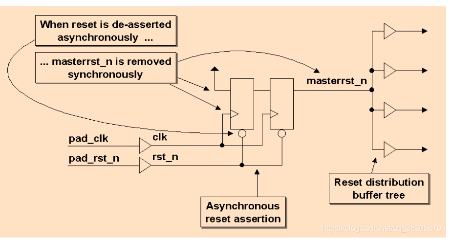
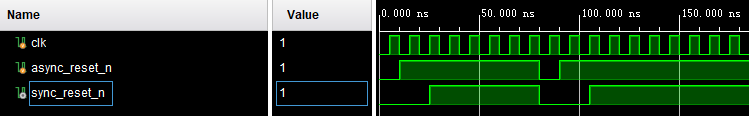

# 异步复位，同步释放
参考：[异步复位同步释放1](https://blog.csdn.net/Noahyo/article/details/112563017)
     [异步复位同步释放2](https://blog.csdn.net/qq_38305370/article/details/115281554?spm=1001.2101.3001.6661.1&utm_medium=distribute.pc_relevant_t0.none-task-blog-2%7Edefault%7ECTRLIST%7ERate-1-115281554-blog-112563017.pc_relevant_paycolumn_v3&depth_1-utm_source=distribute.pc_relevant_t0.none-task-blog-2%7Edefault%7ECTRLIST%7ERate-1-115281554-blog-112563017.pc_relevant_paycolumn_v3&utm_relevant_index=1)
# RTL

# SIM
